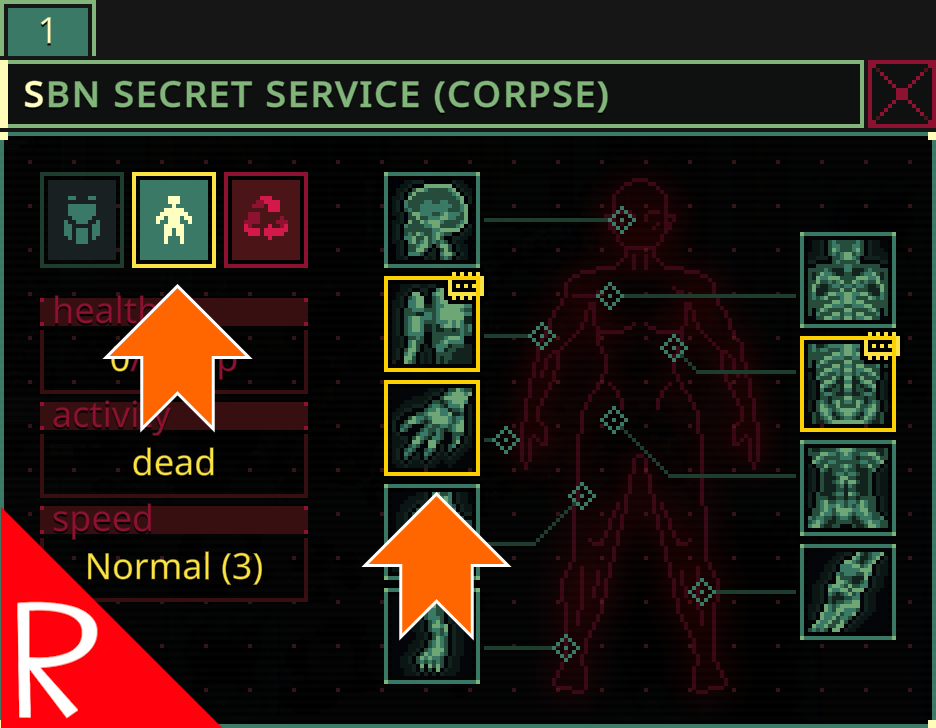

# Quasimorph Augment Indicator

Adds an indicator to the Corpse Screen if the body contains an augment.
Currently this only searches for Human augments and implants due to the amount of junk Quasimorph augmentations on enemies.

The indicators are:
* The Body button will have a green border if there is an implant present.
* The Body button will have a yellow border if there are augments, but no implants.

# Support
If you enjoy my mods and want to buy me a coffee, check out my [Ko-Fi](https://ko-fi.com/nbkredspy71915) page.
Thanks!

# Source Code
Source code is available on GitHub at https://github.com/NBKRedSpy/QM_AugmentIndicator

# Change Log

## 1.2.1
Fix: Corrected missing null check for corpse window logic:

If an enemy was inspected and then the target was removed, an error would occur behind the scenes.
The two examples are reviving a corpse and an enemy being killed and their body merged into a body pile.

Thank you to Discord users Archives and "Lord of Change" for reporting this issue.

## 1.2.0
* Added implant color.

## 1.1.1
* Fix: Slots sometimes incorrectly highlighting non augmented body parts.

## 1.1.0
* Highlights the body part with the augment and/or implant.
